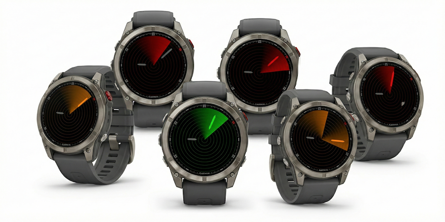
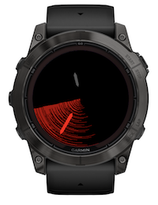

# Garmin Radar Time

A minimalist, elegant, nerdy Garmin Connect IQ watch face that displays the current time as a radar chart, with hour and minute hands as ships lighting up in a radar beam.



Available from [Garmin Connect IQ Developer portal](https://apps.garmin.com/apps/{blank:app-id}) or through the Connect IQ mobile app.

> **Note**  
> Radar Time is part of a [collection of unconventional Garmin watch faces](https://github.com/wkusnierczyk/garmin-watch-faces). It has been developed for fun, as a proof of concept, and as a learning experience.
> It is shared _as is_ as an open source project, with no commitment to long term maintenance and further feature development.
>
> Please use [issues](https://github.com/wkusnierczyk/garmin-radar-time/issues) to provide bug reports or feature requests.  
> Please use [discussions](https://github.com/wkusnierczyk/garmin-radar-time/discussions) for any other comments.
>
> All feedback is wholeheartedly welcome.

## Contents

* [Radar time](#radar-time)
* [Features](#features)
* [Fonts](#fonts)
* [Build, test, deploy](#build-test-deploy)

## Radar time

Radar Time shows the current time with hour and minute hands representted as 'ships', and the second hand represented as a radar beam, lighting up the ships when they come into the radar beam.


## Features

The Radar Time watch face supports the following features:

|Screenshot|Description|
|-|:-|
||**Radar screen**<br/> Hour and minutes displayed as dim ships, seconds as a rotating radar beam.|
||**Lighted ships**<br/> When within the radar beam, ships light up in a bright color.|
||**Color themes**<br/> Ship, radar beam and grid colors can be changed in a customisation menu setting.</br/>_Not available in the current version_.|
||**MIP screens**<br/> MIP screens handle only 64 colors, which makes displaying a smooth radar beam a challenge. Instead, on MIP screens the beam is drawn by varying the number of waves depending on the angular distance from the leading beam edge.|

## Fonts

The Radar Time watch face does not use any fonts.

## Build, test, deploy

To modify and build the sources, you need to have installed:

* [Visual Studio Code](https://code.visualstudio.com/) with [Monkey C extension](https://developer.garmin.com/connect-iq/reference-guides/visual-studio-code-extension/).
* [Garmin Connect IQ SDK](https://developer.garmin.com/connect-iq/sdk/).

Consult [Monkey C Visual Studio Code Extension](https://developer.garmin.com/connect-iq/reference-guides/visual-studio-code-extension/) for how to execute commands such as `build` and `test` to the Monkey C runtime.

You can use the included `Makefile` to conveniently trigger some of the actions from the command line.

```bash
# build binaries from sources
make build

# run unit tests -- note: requires the simulator to be running
make test

# run the simulation
make run

# clean up the project directory
make clean
```

To sideload your application to your Garmin watch, see [developer.garmin.com/connect-iq/connect-iq-basics/your-first-app](https://developer.garmin.com/connect-iq/connect-iq-basics/your-first-app/).
