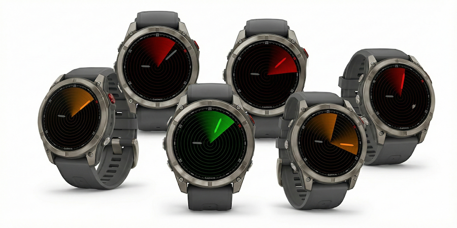
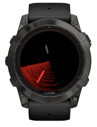

# Garmin Radar Time

A minimalist, elegant, nerdy Garmin Connect IQ watch face that displays the current time as a radar chart, with hour and minute hands as ships lighting up in a radar beam.



Available from [Garmin Connect IQ Developer portal](https://apps.garmin.com/apps/b8ce1105-3cec-4b65-93a4-75e51ea4ac66) or through the Connect IQ mobile app.

> **Note**  
> Radar Time is part of a [collection of unconventional Garmin watch faces](https://github.com/wkusnierczyk/garmin-watch-faces). It has been developed for fun, as a proof of concept, and as a learning experience.
> It is shared _as is_ as an open source project, with no commitment to long term maintenance and further feature development.
>
> Please use [issues](https://github.com/wkusnierczyk/garmin-radar-time/issues) to provide bug reports or feature requests.  
> Please use [discussions](https://github.com/wkusnierczyk/garmin-radar-time/discussions) for any other comments.
>
> All feedback is wholeheartedly welcome.

## Contents

* [Radar time](#radar-time)
* [Features](#features)
* [Settings](#settings)
* [Fonts](#fonts)
* [Build, test, deploy](#build-test-deploy)

## Radar time

Radar Time shows the current time with hour and minute hands representted as 'ships', and the second hand represented as a radar beam, lighting up the ships when they come into the radar beam.


## Features

The Radar Time watch face supports the following features:

|Screenshot|Description|
|-|:-|
||**Radar screen**<br/> Hour and minutes displayed as dim ships, seconds as a rotating radar beam.|
||**Lighted ships**<br/> When within the radar beam, ships light up in a bright color.|
||**Color schemes**<br/> Five preset color schemes — red (default), green, blue, orange, yellow — applied uniformly to the radar grid, beam, and lit ships. Change from the watch face Customize menu (with live preview) or from the Garmin Connect mobile app. See [Settings](#settings).|
||**MIP screens**<br/> MIP screens handle only 64 colors, which makes displaying a smooth radar beam a challenge. Instead, on MIP screens the beam is drawn by varying the number of waves depending on the angular distance from the leading beam edge.|

## Settings

Radar Time ships with five color schemes — **red** (default), **green**, **blue**, **orange**, and **yellow**. The selection applies uniformly to the radar grid, the beam, and the lit ships. Your choice persists across watch reboots.

There are two ways to change the color:

### On the watch

1. Long-press the watch face to open the system Customize menu.
2. Select **Color**. A live preview opens — the radar renders in the currently selected scheme with the scheme name shown at the bottom.
3. Tap the screen or press the select button to cycle through the five schemes. The radar redraws on each tap so you can see how each color looks.
4. Press **Back** to exit. The last cycled scheme is the one that stays.

### From the Garmin Connect mobile app

1. Open Garmin Connect on your phone.
2. Navigate to your watch → **Watch Faces** → **Radar Time** → **Settings**.
3. Pick a color from the **Color** dropdown.
4. Tap **Save** to push the change to your watch over Bluetooth.

## Fonts

The Radar Time watch face does not use any fonts.

## Build, test, deploy

To modify and build the sources, you need to have installed:

* [Visual Studio Code](https://code.visualstudio.com/) with [Monkey C extension](https://developer.garmin.com/connect-iq/reference-guides/visual-studio-code-extension/).
* [Garmin Connect IQ SDK](https://developer.garmin.com/connect-iq/sdk/).

Consult [Monkey C Visual Studio Code Extension](https://developer.garmin.com/connect-iq/reference-guides/visual-studio-code-extension/) for how to execute commands such as `build` and `test` to the Monkey C runtime.

You can use the included `Makefile` to conveniently trigger some of the actions from the command line.

```bash
# build binaries from sources
make build

# run unit tests -- note: requires the simulator to be running
make test

# run the simulation
make run

# clean up the project directory
make clean
```

To sideload your application to your Garmin watch, see [developer.garmin.com/connect-iq/connect-iq-basics/your-first-app](https://developer.garmin.com/connect-iq/connect-iq-basics/your-first-app/).
